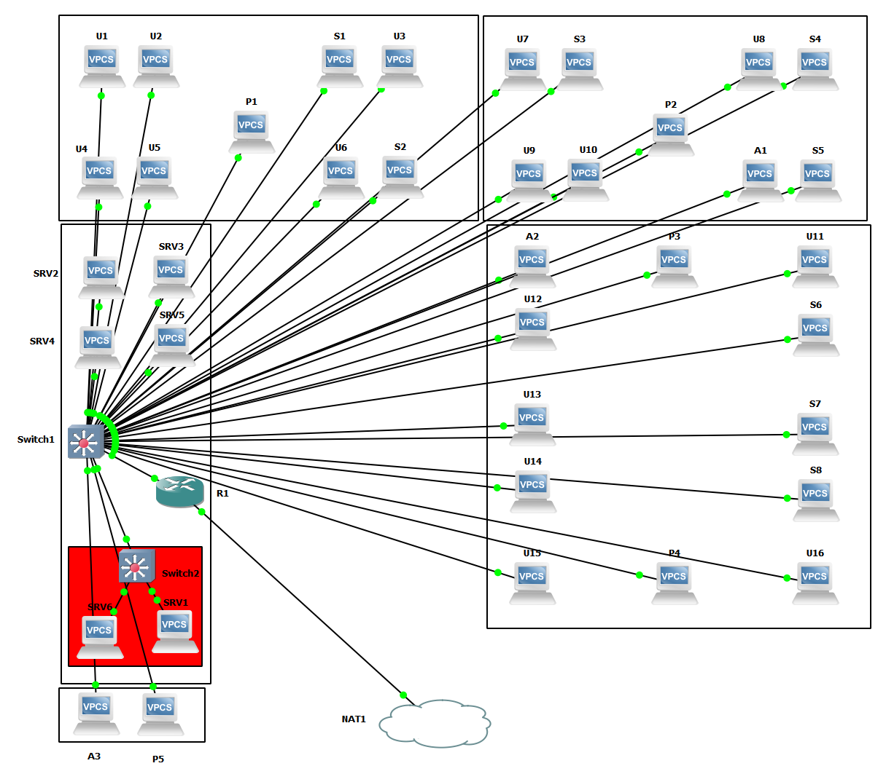

# TP3 : Routage INTER-VLAN + mise en situation
## I. Router-on-a-stick
```
PC1> show ip                    

NAME        : PC1[1]
IP/MASK     : 10.3.10.1/24
GATEWAY     : 10.3.10.254
DNS         : 
MAC         : 00:50:79:66:68:00
LPORT       : 10016
RHOST:PORT  : 127.0.0.1:10017
MTU:        : 1500
```
```
PC2> show ip 

NAME        : PC2[1]
IP/MASK     : 10.3.20.2/24
GATEWAY     : 10.3.20.254
DNS         : 
MAC         : 00:50:79:66:68:01
LPORT       : 10018
RHOST:PORT  : 127.0.0.1:10019
MTU:        : 1500
```
```
PC3> show ip

NAME        : PC3[1]
IP/MASK     : 10.3.20.3/24
GATEWAY     : 10.3.20.254
DNS         : 
MAC         : 00:50:79:66:68:02
LPORT       : 10020
RHOST:PORT  : 127.0.0.1:10021
MTU:        : 1500
```
```
PC3> show ip

NAME        : PC3[1]
IP/MASK     : 10.3.20.3/24
GATEWAY     : 10.3.20.254
DNS         : 
MAC         : 00:50:79:66:68:02
LPORT       : 10020
RHOST:PORT  : 127.0.0.1:10021
MTU:        : 1500
```
```
P1> show ip                    

NAME        : P1[1]
IP/MASK     : 10.3.40.1/24
GATEWAY     : 10.3.40.254
DNS         : 
MAC         : 00:50:79:66:68:04
LPORT       : 10024
RHOST:PORT  : 127.0.0.1:10025
MTU:        : 1500
```

### ping a faire

## II. Cas concret



Table d'adressage (tous les réseaux sont /24) :

| hostname | net10 | net23 | net24 | net25 | net33 | net34 | net35 | net41 | net43 | net44 | net45 | net50 | net60 |
|:--------:|:-----------:|:-----------:|:-----------:|:-----------:|:-----------:|:-----------:|:-----------:|:-----------:|:-----------:|:-----------:|:-----------:|:-----------:|:-----------:|
| U1 | X | 10.4.23.100 | X | X | X | X | X | X | X | X | X | X | X |
| U2 | X | 10.4.23.101 | X | X | X | X | X | X | X | X | X | X | X |
| U3 | X | 10.4.23.102 | X | X | X | X | X | X | X | X | X | X | X |
| U4 | X | 10.4.23.103 | X | X | X | X | X | X | X | X | X | X | X |
| U5 | X | 10.4.23.104 | X | X | X | X | X | X | X | X | X | X | X |
| U6 | X | 10.4.23.105 | X | X | X | X | X | X | X | X | X | X | X |
| U7 | X | X | 10.4.24.100 | X | X | X | X | X | X | X | X | X | X |
| U8 | X | X | 10.4.24.101 | X | X | X | X | X | X | X | X | X | X |
| U9 | X | X | 10.4.24.102 | X | X | X | X | X | X | X | X | X | X |
| U10 | X | X | 10.4.24.103 | X | X | X | X | X | X | X | X | X | X |
| U11 | X | X | X | 10.4.25.100 | X | X | X | X | X | X | X | X | X |
| U12 | X | X | X | 10.4.25.101 | X | X | X | X | X | X | X | X | X |
| U13 | X | X | X | 10.4.25.102 | X | X | X | X | X | X | X | X | X |
| U14 | X | X | X | 10.4.25.103 | X | X | X | X | X | X | X | X | X |
| U15 | X | X | X | 10.4.25.104 | X | X | X | X | X | X | X | X | X |
| U16 | X | X | X | 10.4.25.105 | X | X | X | X | X | X | X | X | X |
| S1 | X | X | X | X | 10.4.33.100 | X | X | X | X | X | X | X | X |
| S2 | X | X | X | X | 10.4.33.101 | X | X | X | X | X | X | X | X |
| S3 | X | X | X | X | X | 10.4.34.100 | X | X | X | X | X | X | X |
| S4 | X | X | X | X | X | 10.4.34.101 | X | X | X | X | X | X | X |
| S5 | X | X | X | X | X | 10.4.34.102 | X | X | X | X | X | X | X |
| S6 | X | X | X | X | X | X | 10.4.35.100 | X | X | X | X | X | X |
| S7 | X | X | X | X | X | X | 10.4.35.101 | X | X | X | X | X | X |
| S8 | X | X | X | X | X | X | 10.4.35.102 | X | X | X | X | X | X |
| A1 | 10.4.10.100 | X | X | X | X | X | X | X | X | X | X | X | X |
| A2 | 10.4.10.101 | X | X | X | X | X | X | X | X | X | X | X | X |
| A3 | 10.4.10.102 | X | X | X | X | X | X | X | X | X | X | X | X |
| P1 | X | X | X | X | X | X | X | X | 10.4.43.100 | X | X | X | X |
| P2 | X | X | X | X | X | X | X | X | X | 10.4.44.100 | X | X | X |
| P3 | X | X | X | X | X | X | X | X | X | X | 10.4.45.100 | X | X |
| P4 | X | X | X | X | X | X | X | X | X | X | 10.4.45.101 | X | X |
| P5 | X | X | X | X | X | X | X | 10.4.41.100 | X | X | X | X | X |
| SRV1 | X | X | X | X | X | X | X | X | X | X | X | X | 10.4.60.100 |
| SRV2 | X | X | X | X | X | X | X | X | X | X | X | 10.4.50.100 | X |
| SRV3 | X | X | X | X | X | X | X | X | X | X | X | 10.4.50.101 | X |
| SRV4 | X | X | X | X | X | X | X | X | X | X | X | 10.4.50.102 | X |
| SRV5 | X | X | X | X | X | X | X | X | X | X | X | 10.4.50.103 | X |
| SRV6 | X | X | X | X | X | X | X | X | X | X | X | X | 10.4.60.101 |
| R1 | 10.4.10.254 | 10.4.23.254 | 10.4.24.254 | 10.4.25.254 | 10.4.33.254 | 10.4.34.254 | 10.4.35.254 | 10.4.41.254 | 10.4.43.254 | 10.4.44.254 | 10.4.45.254 | 10.4.50.254 | 10.4.60.254 |


### Preuves de fonctionnement
#### Preuves que chaque imprimantes ne peuvent que communiquer avec leurs salle.
##### Printer 1
Ping de Printer1(Salle R3) --> User1(Salle R3)
```
P1> ping 10.4.23.100
10.4.23.100 icmp_seq=1 timeout
84 bytes from 10.4.23.100 icmp_seq=2 ttl=63 time=14.908 ms
84 bytes from 10.4.23.100 icmp_seq=3 ttl=63 time=16.738 ms
84 bytes from 10.4.23.100 icmp_seq=4 ttl=63 time=20.371 ms
84 bytes from 10.4.23.100 icmp_seq=5 ttl=63 time=18.395 ms
```
On prend en compte qu'il peut contacter tout les User dans la salle R3
Ping de Printer1(Salle R3) --> User7(Salle R4)
```
P1> ping 10.4.24.100
*10.4.43.254 icmp_seq=1 ttl=255 time=9.651 ms (ICMP type:3, code:13, Communicati                  on administratively prohibited)
10.4.24.100 icmp_seq=2 timeout
10.4.24.100 icmp_seq=3 timeout
```
On voit que le traffic n'est pas autorisé vers la salle R4 (On généralise sa pour toute les autres salles)

Ping de Printer1(salle R3) --> Stagiaires1(Salle R3)
```
P1> ping 10.4.33.100
10.4.33.100 icmp_seq=1 timeout
84 bytes from 10.4.33.100 icmp_seq=2 ttl=63 time=21.912 ms
84 bytes from 10.4.33.100 icmp_seq=3 ttl=63 time=17.230 ms
84 bytes from 10.4.33.100 icmp_seq=4 ttl=63 time=19.731 ms
84 bytes from 10.4.33.100 icmp_seq=5 ttl=63 time=14.255 ms
```
On prend en compte qu'il peut contacter tout les stagiaires dans la salle R3

Ping de Printer1(Salle R3) --> Stagiaires4(Salle R4)
```
P1> ping 10.4.34.101
*10.4.43.254 icmp_seq=1 ttl=255 time=7.217 ms (ICMP type:3, code:13, Communication administratively prohibited)
10.4.34.101 icmp_seq=2 timeout
10.4.34.101 icmp_seq=3 timeout
```
On voit que le traffic n'est pas autorisé vers la salle R4 (On généralise sa pour toute les autres salles)
##### Printer 2
Ping de Printer2(Salle R4) --> User7(Salle R4)
```
P2> ping 10.4.24.100
10.4.24.100 icmp_seq=1 timeout
84 bytes from 10.4.24.100 icmp_seq=2 ttl=63 time=12.528 ms
84 bytes from 10.4.24.100 icmp_seq=3 ttl=63 time=20.185 ms
84 bytes from 10.4.24.100 icmp_seq=4 ttl=63 time=19.361 ms
84 bytes from 10.4.24.100 icmp_seq=5 ttl=63 time=14.397 ms
```
On prend en compte qu'il peut contacter tout les User dans la salle R4

Ping de Printer2(Salle R4) --> User16(Salle R5)
```
P2> ping 10.4.25.105
*10.4.44.254 icmp_seq=1 ttl=255 time=4.074 ms (ICMP type:3, code:13, Communication administratively prohibited)
10.4.25.105 icmp_seq=2 timeout
10.4.25.105 icmp_seq=3 timeout
```
On voit que le traffic n'est pas autorisé vers la salle R5 (On généralise sa pour toute les autres salles)

Ping de Printer2(salle R4) --> Stagiaires3(Salle R4)
```
P2> ping 10.4.34.101
10.4.34.101 icmp_seq=1 timeout
84 bytes from 10.4.34.101 icmp_seq=2 ttl=63 time=15.534 ms
84 bytes from 10.4.34.101 icmp_seq=3 ttl=63 time=19.495 ms
84 bytes from 10.4.34.101 icmp_seq=4 ttl=63 time=14.324 ms
84 bytes from 10.4.34.101 icmp_seq=5 ttl=63 time=16.668 ms
```
On prend en compte qu'il peut contacter tout les stagiaires dans la salle R3

Ping de Printer2(salle R4) --> Stagiaires1(Salle R3)
```
P2> ping 10.4.33.100
*10.4.44.254 icmp_seq=1 ttl=255 time=8.724 ms (ICMP type:3, code:13, Communication administratively prohibited)
10.4.33.100 icmp_seq=2 timeout
10.4.33.100 icmp_seq=3 timeout
```
On voit que le traffic n'est pas autorisé vers la salle R3 (On généralise sa pour toute les autres salles)

##### Printer 3-4
Ping de Printer3(Salle R5) --> User16(Salle R5)
```
P3> ping 10.4.25.105
10.4.25.105 icmp_seq=1 timeout
84 bytes from 10.4.25.105 icmp_seq=2 ttl=63 time=19.355 ms
84 bytes from 10.4.25.105 icmp_seq=3 ttl=63 time=14.387 ms
84 bytes from 10.4.25.105 icmp_seq=4 ttl=63 time=12.912 ms
84 bytes from 10.4.25.105 icmp_seq=5 ttl=63 time=13.379 
```
On prend en compte qu'il peut contacter tout les User dans la salle R5

Ping de Printer3(Salle R5) --> User7(Salle R4)
```
P3> ping 10.4.24.100
*10.4.45.254 icmp_seq=1 ttl=255 time=8.053 ms (ICMP type:3, code:13, Communication administratively prohibited)
10.4.24.100 icmp_seq=2 timeout
10.4.24.100 icmp_seq=3 timeout
```
On voit que le traffic n'est pas autorisé vers la salle R4 (On généralise sa pour toute les autres salles)

Les stagiaires et l'admin de la salle R5 ont aussi accés aux imprimantes dans la salle R5.

#### Preuve que seul admin 1 peut contacter le serveur 4
Ping Admin1 --> SRV4
```
A1> ping 10.4.50.102
10.4.50.102 icmp_seq=1 timeout
84 bytes from 10.4.50.102 icmp_seq=2 ttl=63 time=12.940 ms
84 bytes from 10.4.50.102 icmp_seq=3 ttl=63 time=14.890 ms
84 bytes from 10.4.50.102 icmp_seq=4 ttl=63 time=19.174 ms
84 bytes from 10.4.50.102 icmp_seq=5 ttl=63 time=13.584 ms
```
Ping Admin2 --> SRV4
```
A2> ping 10.4.50.102
*10.4.10.254 icmp_seq=1 ttl=255 time=9.641 ms (ICMP type:3, code:13, Communication administratively prohibited)
*10.4.10.254 icmp_seq=2 ttl=255 time=6.073 ms (ICMP type:3, code:13, Communication administratively prohibited)
*10.4.10.254 icmp_seq=3 ttl=255 time=4.850 ms (ICMP type:3, code:13, Communication administratively prohibited)
```
On voit que le traffic est interdit vers le serveur 4 (On généralise ça a l'admin 3)

#### Preuve que les serveurs safe sont accessible que aux admins
Ping Admin1 --> SRV6
```
A1> ping 10.4.60.101
10.4.60.101 icmp_seq=1 timeout
84 bytes from 10.4.60.101 icmp_seq=2 ttl=63 time=21.040 ms
84 bytes from 10.4.60.101 icmp_seq=3 ttl=63 time=22.142 ms
```
On généralise cet exemple a tout les admins

Ping Admin1 --> SRV1
```
A1> ping 10.4.60.100
10.4.60.100 icmp_seq=1 timeout
84 bytes from 10.4.60.100 icmp_seq=2 ttl=63 time=13.955 ms
84 bytes from 10.4.60.100 icmp_seq=3 ttl=63 time=20.177 ms
84 bytes from 10.4.60.100 icmp_seq=4 ttl=63 time=11.696 ms
84 bytes from 10.4.60.100 icmp_seq=5 ttl=63 time=17.685 ms
```
On généralise cet exemple a tout les admins

Ping User1 --> SRV1
```
U1> ping 10.4.60.100
*10.4.23.254 icmp_seq=1 ttl=255 time=19.836 ms (ICMP type:3, code:13, Communication administratively prohibited)
10.4.60.100 icmp_seq=2 timeout
*10.4.23.254 icmp_seq=3 ttl=255 time=6.695 ms (ICMP type:3, code:13, Communication administratively prohibited)
```
On généralise cet exemple a tout les autres

Ping User1 --> SRV6
```
U1> ping 10.4.60.101
*10.4.23.254 icmp_seq=1 ttl=255 time=6.878 ms (ICMP type:3, code:13, Communication administratively prohibited)
10.4.60.101 icmp_seq=2 timeout
*10.4.23.254 icmp_seq=3 ttl=255 time=5.299 ms (ICMP type:3, code:13, Communication administratively prohibited)
```
On généralise cet exemple a tout les autres

### Comment j'ai fait ça
J'ai réaliser c'est controle d'accés grâce a des ACL qui permettent de specifier l'accés d'un réseau ou d'une ip a un reseau ou a une ip ou a n'importe qui.

#### Ma liste d'ACL 
```
R1#show access-lists
Extended IP access list 100
    10 permit ip host 10.4.10.100 host 10.4.50.102
    20 deny ip any host 10.4.50.102
    30 permit ip 10.4.10.0 0.0.0.255 any
    40 permit ip 10.4.23.0 0.0.0.255 any
    50 permit ip 10.4.24.0 0.0.0.255 any
    60 permit ip 10.4.25.0 0.0.0.255 any
    70 permit ip 10.4.50.0 0.0.0.255 any
    80 permit ip 10.4.41.0 0.0.0.255 any
    90 permit ip 10.4.43.0 0.0.0.255 any
    100 permit ip 10.4.44.0 0.0.0.255 any
    110 permit ip 10.4.45.0 0.0.0.255 any
    120 deny ip any any
Extended IP access list 110
    10 permit ip 10.4.10.0 0.0.0.255 any
    20 permit ip 10.4.60.0 0.0.0.255 any
    30 deny ip any any (4 matches)
Extended IP access list 120
    10 permit ip host 10.4.43.100 any
    20 permit ip 10.4.23.0 0.0.0.255 any
    30 permit ip 10.4.33.0 0.0.0.255 any
    40 deny ip any any
Extended IP access list 130
    10 permit ip host 10.4.44.100 any
    20 permit ip 10.4.24.0 0.0.0.255 any
    30 permit ip 10.4.34.0 0.0.0.255 any
    40 permit ip host 10.4.10.100 host 10.4.44.100
    50 deny ip any any
Extended IP access list 140
    10 permit ip host 10.4.45.100 any
    20 permit ip host 10.4.45.101 any
    30 permit ip 10.4.25.0 0.0.0.255 any
    40 permit ip 10.4.35.0 0.0.0.255 any
    50 permit ip host 10.4.10.101 host 10.4.45.100
    60 permit ip host 10.4.10.101 host 10.4.45.101
    70 deny ip any any
Extended IP access list 150
    10 permit ip host 10.4.10.102 host 10.4.41.100
    20 permit ip host 10.4.41.100 any
    30 deny ip any any
Extended IP access list 160
    10 permit ip 10.4.23.0 0.0.0.255 any (34 matches)
    20 permit ip 10.4.50.0 0.0.0.255 any
    30 permit ip 10.4.43.0 0.0.0.255 any
    40 permit ip 10.4.24.0 0.0.0.255 any (10 matches)
    50 permit ip 10.4.25.0 0.0.0.255 any
    60 deny ip any any
Extended IP access list 170
    10 permit ip 10.4.24.0 0.0.0.255 any (10 matches)
    20 permit ip 10.4.50.0 0.0.0.255 any
    30 permit ip 10.4.44.0 0.0.0.255 any
    40 permit ip 10.4.23.0 0.0.0.255 any (10 matches)
    50 permit ip 10.4.25.0 0.0.0.255 any
    60 deny ip any any
Extended IP access list 180
    10 permit ip 10.4.25.0 0.0.0.255 any
    20 permit ip 10.4.50.0 0.0.0.255 any
    30 permit ip 10.4.45.0 0.0.0.255 any
    40 permit ip 10.4.23.0 0.0.0.255 any
    50 permit ip 10.4.24.0 0.0.0.255 any
    60 deny ip any any
Extended IP access list 190
    10 permit ip 10.4.33.0 0.0.0.255 any
    20 permit ip 10.4.43.0 0.0.0.255 any
    30 deny ip any any
Extended IP access list 191
    10 permit ip 10.4.34.0 0.0.0.255 any
    20 permit ip 10.4.44.0 0.0.0.255 any
    30 deny ip any any
Extended IP access list 192
    10 permit ip 10.4.35.0 0.0.0.255 any
    20 permit ip 10.4.45.0 0.0.0.255 any
    30 deny ip any any
```
#### Tableau de correspondance ACL --> Subnet

ACL 100 --> 10.4.50.0 (Serveurs)  
ACL 110 --> 10.4.60.0 (Serveurs Safe)  
ACL 120 --> 10.4.41.0 (Printer R1)  
ACL 130 --> 10.4.44.0 (Printer R4)  
ACL 140 --> 10.4.45.0 (Printer R5)  
ACL 150 --> 10.4.43.0 (Printer R3)  
ACL 160 --> 10.4.23.0 (Users R3)  
ACL 170 --> 10.4.24.0 (Users R4)  
ACL 180 --> 10.4.25.0 (Users R5)  
ACL 190 --> 10.4.33.0 (Stagiaires R3)  
ACL 191 --> 10.4.34.0 (Stagiaires R4)  
ACL 192 --> 10.4.35.0 (Stagiaires R5)

### La partie hard
#### Emplacement des switchs et des routeurs
J'ai décidé d'utiliser 2 switch et un routeur. J'ai essayé de réduire au maximum le coût materiel en réduisant a 2 le nombre de switch, je les ai placé dans la salle serveur avec le routeur car je pars du principe que seul les personnes habilité peuvent entrée dans cette salle et donc évité que la femme de ménage les débranche pour brancher son aspirateur ou alors que une personne mailveillante veuille changer les configurations du routeur ou des switch et donc d'avoir accées au serveurs sensible par exemple. J'ai aussi deux switch car un sers a la populace et l'autre sers a isoler physiquement les serveurs sensible.

#### Longueur des câbles 
Alors nous avons 38 postes de travail/serveurs, Il nous faut alors au moins 38 câbles.
Nous avons 2 switch et un routeur donc on rajoute deux câbles supplémentaire (Je ne compte pas celui qui relie le routeur au NAT)
On a 40 câbles
On a besoin de 8 câbles court ( tout ce qui relie switch 1 vers la salle serveur, le switch 2 et le routeur ), de 11 câbles moyen (Tout ce qui relie le switch 1 a la salle R1 et R3) et de 21 câbles long ( tout le reste ).

#### Qui a accès à qui exactement ?

* tous les postes ne peuvent joindre que l'imprimante de leur propre salle
* les serveurs sensibles n'ont pas accès à internet
* seul l'admin 1 (`A1`) a accès au serveur 4 (`SRV4`)

✅ = peuvent se joindre
❌ = ne peuvent pas se joindre

X | Admins | Users | Stagiaires | Serveurs | SS | Imprimantes
--- | --- | --- | --- | --- | --- | --- | 
Admins | ✅ | ❌ | ❌ | ✅ | ✅ | ✅ |
Users | ❌ | ✅ | ❌ | ✅ | ❌ | ✅ |
Stagiaires | ❌ | ❌ | ✅ | ❌ | ❌ | ✅ |
Serveurs | ✅ | ✅ | ❌ | ✅ | ❌ | ✅ |
Serveurs sensibles | ✅ | ❌ | ❌ | ❌ | ✅ | ❌ |
Imprimantes | ✅ | ✅ | ✅ | ✅ | ❌ | ✅ |
