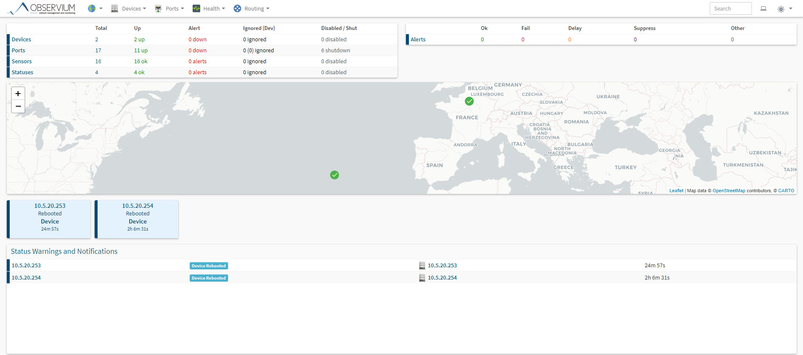
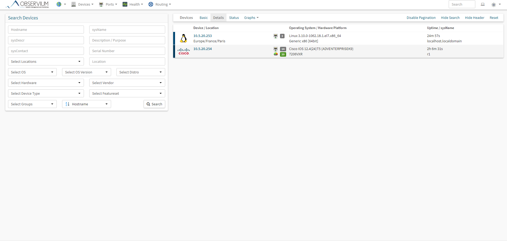
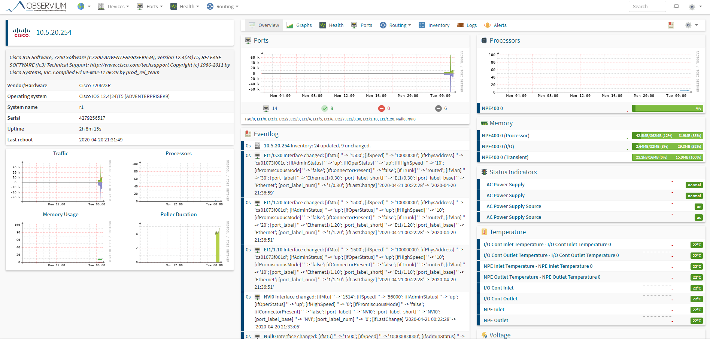
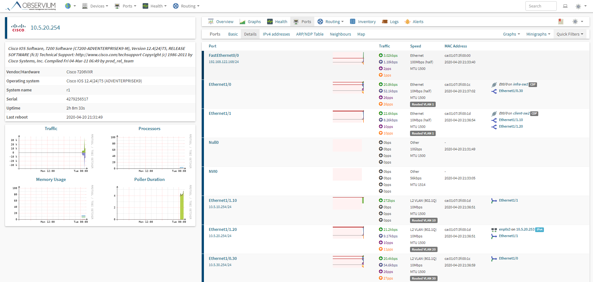
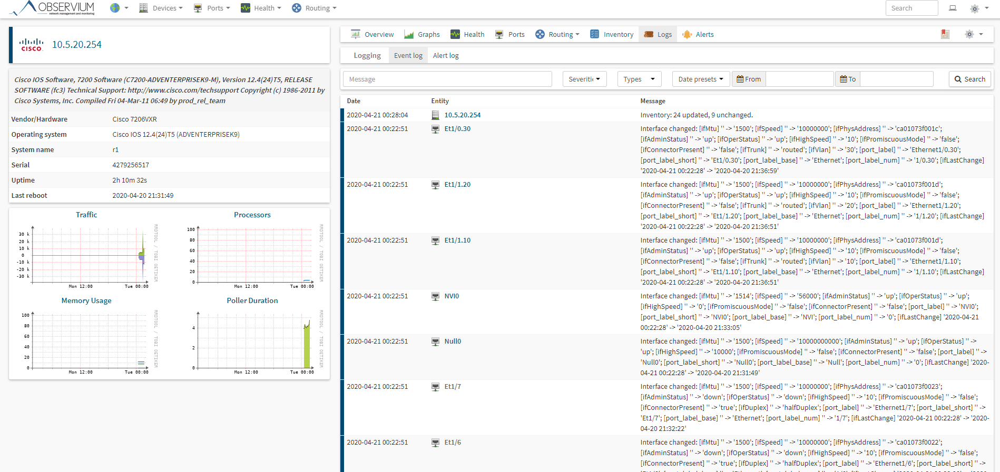
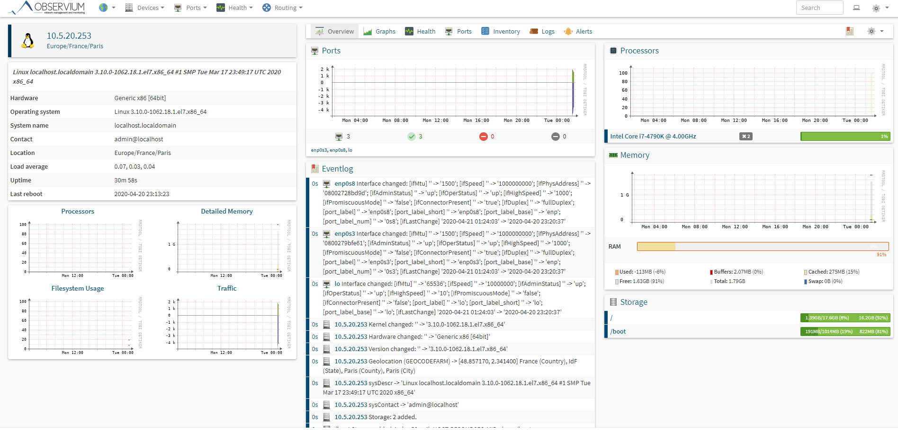
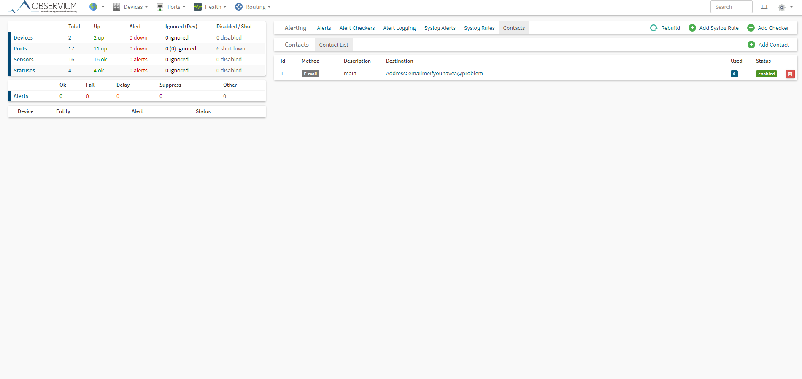

# Salade tomate oignon
## Configuration des switch : 
**(Je montre les fichiers de configuration avec les arguments pertinents pour eviter de perdre du temps)**
### client-sw1
```
!
interface Ethernet0/0
 switchport trunk encapsulation dot1q
 duplex auto
!
interface Ethernet0/1
 switchport access vlan 10
 switchport mode access
 duplex auto
!
interface Ethernet0/2
 switchport access vlan 20
 switchport mode access
 duplex auto
!
```
### client-sw2
```
!
interface Ethernet0/0
 switchport trunk encapsulation dot1q
 switchport mode trunk
 duplex auto
!
interface Ethernet0/1
 switchport trunk encapsulation dot1q
 switchport trunk allowed vlan 10,20
 switchport mode trunk
 duplex auto
!
interface Ethernet0/2
 switchport trunk encapsulation dot1q
 switchport mode trunk
 duplex auto
!
interface Ethernet0/3
 switchport access vlan 10
 switchport mode access
 duplex auto
!
interface Ethernet1/0
 switchport access vlan 20
 switchport mode access
 duplex auto
!
```
### client-sw3
```
!
interface Ethernet0/0
 switchport trunk encapsulation dot1q
 switchport mode trunk
 duplex auto
!
interface Ethernet0/1
 switchport access vlan 10
 switchport mode access
 duplex auto
!
interface Ethernet0/2
 switchport access vlan 20
 switchport mode access
 duplex auto
!
interface Ethernet0/3
 switchport access vlan 20
 switchport mode access
 duplex auto
!
```
### infra-sw1
```
!
interface Ethernet0/0
 switchport trunk encapsulation dot1q
 switchport trunk allowed vlan 30
 switchport mode trunk
 duplex auto
!
interface Ethernet0/1
 switchport access vlan 30
 switchport mode access
 duplex auto
!
interface Ethernet0/2
 switchport access vlan 30
 switchport mode access
 duplex auto
!
```
### R1
```
!
interface FastEthernet0/0
 ip address dhcp
 ip nat outside
 ip virtual-reassembly
 duplex half
!
interface Ethernet1/0
 no ip address
 duplex half
!
interface Ethernet1/0.10
 encapsulation dot1Q 10
 ip address 10.5.10.254 255.255.255.0
 ip nat inside
 ip virtual-reassembly
!
interface Ethernet1/0.20
 encapsulation dot1Q 20
 ip address 10.5.20.254 255.255.255.0
 ip nat inside
 ip virtual-reassembly
!
interface Ethernet1/1
 no ip address
 duplex half
!
interface Ethernet1/1.30
 encapsulation dot1Q 30
 ip address 10.5.30.254 255.255.255.0
 ip nat inside
 ip virtual-reassembly
!
!
interface FastEthernet0/0
 ip address dhcp
 ip nat outside
 ip virtual-reassembly
 duplex half
!
interface Ethernet1/0
 no ip address
 duplex half
!
interface Ethernet1/0.10
 encapsulation dot1Q 10
 ip address 10.5.10.254 255.255.255.0
 ip nat inside
 ip virtual-reassembly
!
interface Ethernet1/0.20
 encapsulation dot1Q 20
 ip address 10.5.20.254 255.255.255.0
 ip nat inside
 ip virtual-reassembly
!
interface Ethernet1/1
 no ip address
 duplex half
!
interface Ethernet1/1.30
 encapsulation dot1Q 30
 ip address 10.5.30.254 255.255.255.0
 ip nat inside
 ip virtual-reassembly
!
ip nat inside source list 1 interface FastEthernet0/0 overload
!
access-list 1 permit any
no cdp log mismatch duplex
```
## Ping :
### client1 -> client2
```
guest1> ping guest2
guest2.tp4.b2 resolved to 10.5.20.101
84 bytes from 10.5.20.101 icmp_seq=1 ttl=64 time=0.571 ms
84 bytes from 10.5.20.101 icmp_seq=2 ttl=64 time=0.945 ms
84 bytes from 10.5.20.101 icmp_seq=3 ttl=64 time=1.291 ms
84 bytes from 10.5.20.101 icmp_seq=4 ttl=64 time=0.948 ms
```
### client1 -> client3
```
guest1> ping guest3
guest3.tp4.b2 resolved to 10.5.20.102
84 bytes from 10.5.20.102 icmp_seq=1 ttl=64 time=1.120 ms
84 bytes from 10.5.20.102 icmp_seq=2 ttl=64 time=1.289 ms
84 bytes from 10.5.20.102 icmp_seq=3 ttl=64 time=1.297 ms
84 bytes from 10.5.20.102 icmp_seq=4 ttl=64 time=1.167 ms
```
On vois a travers les deux derniers ping que le serveurs dns fonctionne bien
### admin1 -> admin2
```
admin1> ping 10.5.10.12
84 bytes from 10.5.10.12 icmp_seq=1 ttl=64 time=0.699 ms
84 bytes from 10.5.10.12 icmp_seq=2 ttl=64 time=0.916 ms
84 bytes from 10.5.10.12 icmp_seq=3 ttl=64 time=1.078 ms
84 bytes from 10.5.10.12 icmp_seq=4 ttl=64 time=1.069 ms
```
### admin2 -> admin3
```
admin1> ping 10.5.10.13
84 bytes from 10.5.10.13 icmp_seq=1 ttl=64 time=1.156 ms
84 bytes from 10.5.10.13 icmp_seq=2 ttl=64 time=1.284 ms
84 bytes from 10.5.10.13 icmp_seq=3 ttl=64 time=1.086 ms
84 bytes from 10.5.10.13 icmp_seq=4 ttl=64 time=1.191 ms
```
## Configuration du serveur DHCP :
```
[root@localhost ~]# cat /etc/dhcp/dhcpd.conf
#
## DHCP Server Configuration file.
##   see /usr/share/doc/dhcp*/dhcpd.conf.example
##   see dhcpd.conf(5) man page
##
#
## DHCP lease lifecycle
default-lease-time 600;
max-lease-time 7200;

# This server is the only DHCP server we got
# So it is the authoritative one
authoritative;

# Configure logging
log-facility local7;

# Actually configure the DHCP server to serve our network
subnet 10.5.20.0 netmask 255.255.255.0 {
# IPs that our DHCP server can give to client
  range 10.5.20.100 10.5.20.150;

# Domain name served and DNS server (optional)
# The DHCP server gives this info to clients
  option domain-name "tp4.b2";
  option domain-name-servers 10.5.30.11;

# Gateway of the network (optional)
# The DHCP server gives this info to clients
  option routers 10.5.20.254;

# Specify broadcast addres of the network (optional)
  option broadcast-address 10.5.20.255;
}
```
## Configuration du serveur DNS :
### named.conf
```
[root@localhost ~]# cat /etc/named.conf
//
// named.conf
//
// Provided by Red Hat bind package to configure the ISC BIND named(8) DNS
// server as a caching only nameserver (as a localhost DNS resolver only).
//
// See /usr/share/doc/bind*/sample/ for example named configuration files.
//
// See the BIND Administrator's Reference Manual (ARM) for details about the
// configuration located in /usr/share/doc/bind-{version}/Bv9ARM.html

options {
        listen-on port 53 { 127.0.0.1; 10.5.30.11; };
        listen-on-v6 port 53 { ::1; };
        directory       "/var/named";
        dump-file       "/var/named/data/cache_dump.db";
        statistics-file "/var/named/data/named_stats.txt";
        memstatistics-file "/var/named/data/named_mem_stats.txt";
        recursing-file  "/var/named/data/named.recursing";
        secroots-file   "/var/named/data/named.secroots";
        allow-query     { 10.5.20.0/24; 10.5.30.0/24; };

        /*
         - If you are building an AUTHORITATIVE DNS server, do NOT enable recursion.
         - If you are building a RECURSIVE (caching) DNS server, you need to enable
           recursion.
         - If your recursive DNS server has a public IP address, you MUST enable access
           control to limit queries to your legitimate users. Failing to do so will
           cause your server to become part of large scale DNS amplification
           attacks. Implementing BCP38 within your network would greatly
           reduce such attack surface
        */
        recursion yes;

        dnssec-enable yes;
        dnssec-validation yes;

        /* Path to ISC DLV key */
        bindkeys-file "/etc/named.root.key";

        managed-keys-directory "/var/named/dynamic";

        pid-file "/run/named/named.pid";
        session-keyfile "/run/named/session.key";
};

logging {
        channel default_debug {
                file "data/named.run";
                severity dynamic;
        };
};

zone "." IN {
        type hint;
        file "named.ca";
};

zone "tp4.b2" IN {

         type master;

         file "/var/named/tp4.b2.db";

         allow-update { none; };
};

zone "20.5.10.in-addr.arpa" IN {

          type master;

          file "/var/named/20.5.10.db";

          allow-update { none; };
};

include "/etc/named.rfc1912.zones";
include "/etc/named.root.key";
```
### 20.5.10.db 
```
[root@localhost ~]# cat /var/named/20.5.10.db
$TTL    604800
@   IN  SOA     ns1.tp4.b2. root.tp4.b2. (
                                                1001    ;Serial
                                                3H      ;Refresh
                                                15M     ;Retry
                                                1W      ;Expire
                                                1D      ;Minimum TTL
                                                )

;Name Server Information
@ IN  NS      ns1.tp4.b2.


11.30.5.10 IN PTR ns1.tp4.b2.

;PTR Record IP address to HostName
11      IN  PTR     guest1.tp4.b2.
12      IN  PTR     guest2.tp4.b2.
13      IN  PTR     guest3.tp4.b2.
```
### tp4.b2.db 
```
[root@localhost ~]# cat /var/named/tp4.b2.db
$TTL    604800
@   IN  SOA     ns1.tp4.b2. root.tp4.b2. (
                                                1001    ;Serial
                                                3H      ;Refresh
                                                15M     ;Retry
                                                1W      ;Expire
                                                1D      ;Minimum TTL
                                                )

;Name Server Information
@      IN  NS      ns1.tp4.b2.

ns1 IN  A       10.5.30.11
guest1     IN  A       10.5.20.100
guest2     IN  A       10.5.20.101
guest3     IN  A       10.5.20.102
```
## Métrologie Réseau : SNMP, monitoring, gestion de logs
### Installation :
#### Installation des repo :
```
yum install https://dl.fedoraproject.org/pub/epel/epel-release-latest-7.noarch.rpm -y 
yum install http://yum.opennms.org/repofiles/opennms-repo-stable-rhel7.noarch.rpm -y
yum install http://rpms.remirepo.net/enterprise/remi-release-7.rpm -y
```
#### Installation des paquets :
```
yum install yum-utils -y
yum-config-manager --enable remi-php72
yum update -y
yum install wget.x86_64 httpd.x86_64 php.x86_64 php-opcache.x86_64 libvirt.x86_64 php-mysql.x86_64 php-gd.x86_64 php-posix php-pear.noarch cronie.x86_64 net-snmp.x86_64 net-snmp-utils.x86_64 fping.x86_64 mariadb-server.x86_64 mariadb.x86_64 MySQL-python.x86_64 rrdtool.x86_64 subversion.x86_64  jwhois.x86_64 ipmitool.x86_64 graphviz.x86_64 ImageMagick.x86_64 php-sodium.x86_64 -y
```
#### Telechargement de observium :
```
mkdir -p /opt/observium && cd /opt
wget http://www.observium.org/observium-community-latest.tar.gz
tar zxvf observium-community-latest.tar.gz
```
#### Création et configuration de la base de données :
```
systemctl enable mariadb
systemctl start mariadb
/usr/bin/mysqladmin -u root password 'toor'
mysql --user=root --password="toor" --execute="CREATE DATABASE observium DEFAULT CHARACTER SET utf8 COLLATE utf8_general_ci;"
mysql --user=root --password="toor" --database="observium" --execute="GRANT ALL PRIVILEGES ON observium.* TO 'observium'@'localhost' IDENTIFIED BY 'toor';"
```
```
cd observium
cp config.php.default config.php
```
```
./discovery.php -u
```
#### Configuration systeme :
Je determine où est installer fping pour lui préciser sont path dans le fichier de configuration
```
which fping
```
Je rajoute la ligne suivante au fichier config.php
```
$config['fping'] = "/usr/bin/fping";
```
pour que SELinux sois en mode permissive tout d'abord taper cette commande
```
setenforce 0
```
Puis j'edite le fichier /etc/selinux/config pour verifier que SELINUX est bien en permissive
```
SELINUX=permissive
```
Je creer un dossier rrd appartenant au groupe et a l'utilisateur apache
```
mkdir rrd
chown apache:apache rrd
```
J'ajouter ceci dans le fichier ```/etc/httpd/conf.d/observium.conf```
```
<VirtualHost *>
   DocumentRoot /opt/observium/html/
   ServerName  observium.domain.com
   CustomLog /opt/observium/logs/access_log combined
   ErrorLog /opt/observium/logs/error_log
   <Directory "/opt/observium/html/">
     AllowOverride All
     Options FollowSymLinks MultiViews
     Require all granted
   </Directory>
</VirtualHost>
```
Je creer les dossiers de logs pour apache et faire en sorte qu'il appartient au groupe et au user apache
```
mkdir /opt/observium/logs
chown apache:apache /opt/observium/logs
```
J'ajoute un utilisateur
```
cd /opt/observium
./adduser.php nawak toor 10
```
Et le router on doit d'abord activer le snmp sur R1 on se connecte et on tape cette commande :
```
snmp-server community public RO
```
Et on l'ajoute sur le serveur avec observium :
```
./add_device.php 10.5.20.254 v2c
```
ces deux dernières commande permette de découvrir toutes les metrics que nous allons pouvoir utiliser :
```
./discovery.php -h all
./poller.php -h all
```
Pour faire ces commande de façon automatique nous allons creer un tache cron pour cela on ajoute dans le fichier /etc/cron.d/observium :
```
# Execute cette commande toute les 6 heures
33  */6   * * *   root    /opt/observium/discovery.php -h all >> /dev/null 2>&1

# Execute cette commande toute les 5 minutes
*/5 *     * * *   root    /opt/observium/discovery.php -h new >> /dev/null 2>&1

# Execute cette commande toute les 5 minutes
*/5 *     * * *   root    /opt/observium/poller-wrapper.py >> /dev/null 2>&1

# Execute cette commande toute les jours
13 5 * * * root /opt/observium/housekeeping.php -ysel

# Execute cette commande toute les jours
47 4 * * * root /opt/observium/housekeeping.php -yrptb
```
Puis : 
```
systemctl reload crond
```
On ajoute httpd au programme de démarrage et on le démmare :
```
systemctl enable httpd
systemctl start httpd
```
### Installation coté client Linux :
J'ai installer les paquets suivants sur le serveur DHCP :
```
sudo yum install -y telnet net-snmp net-snmp-utils
```
J'ai copier le fichier de configuration snmpd.conf par sécurité
```
cp /etc/snmp/snmpd.conf /etc/snmp/snmpd.conf.old
```
Il faut aussi autoriser le port 161 en UDP
```
firewall-cmd --add-port=161/udp --permanent
firewall-cmd --reload
```
### Utilisation :
#### Voici la page d'acceuil de observium on peut y voir où sont les machines leurs nombres le nombre d'alerte etc...

#### On peut lister toutes les machines avec quelques information sur l'os et leur uptime.

#### Voici le panel de visualisation du router R1 avec différent graph nottament celui de l'utilisation des ports et des information sur la température.

#### Ici on peut voir des graph pour chaque ports du router et aussi leurs assignations.

#### Ici on peut voir les logs de ma machine

#### Voici le panel du serveur DHCP

#### Et ici on vois comment on peut alerter quelqu'un si par exemple la température du serveur dépasse une certaine valeur etc...
